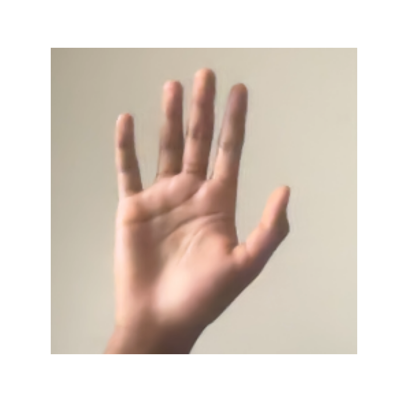
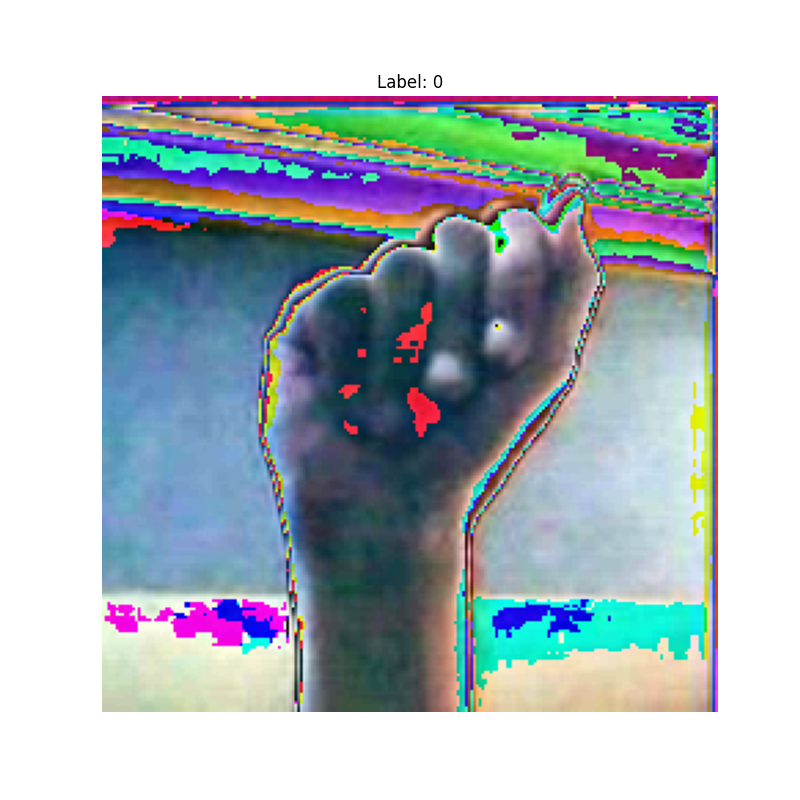
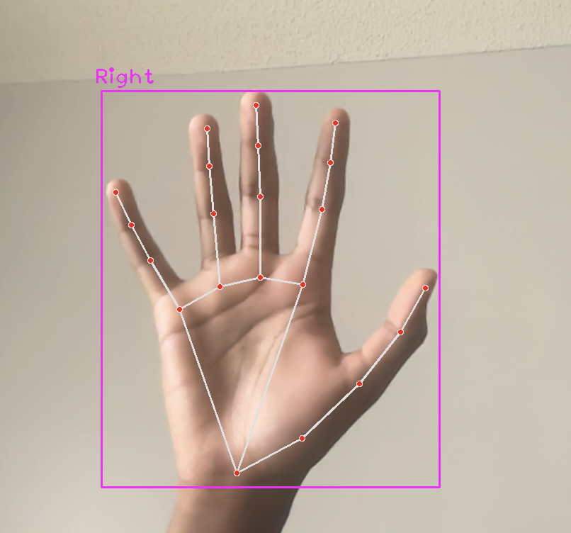
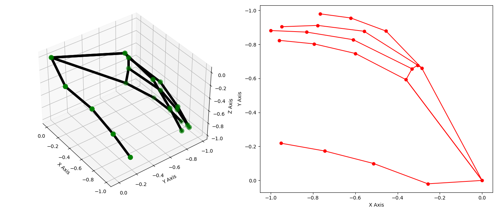
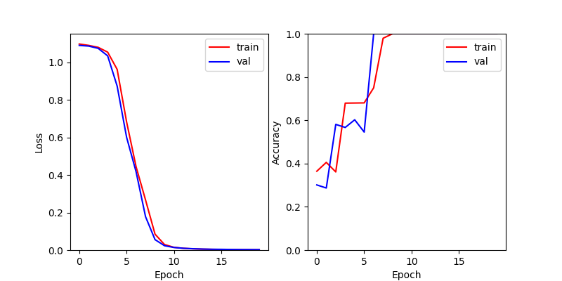
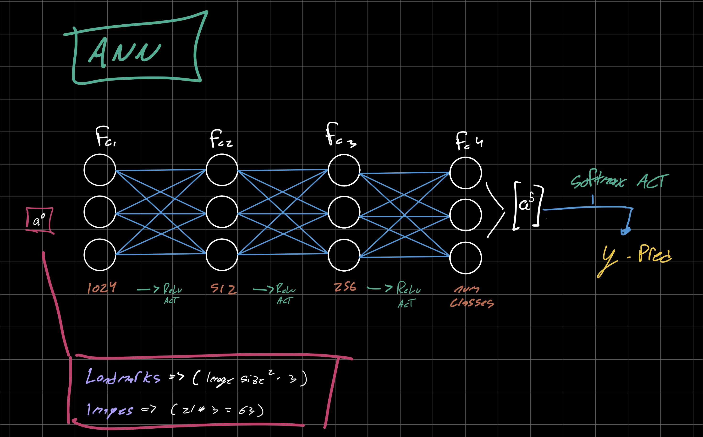
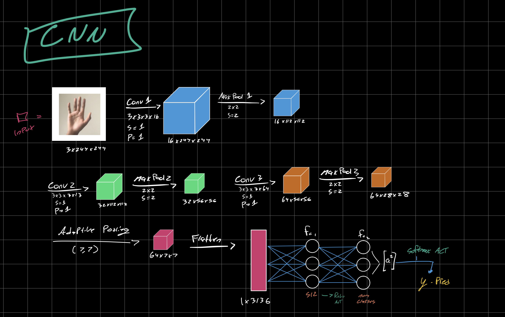
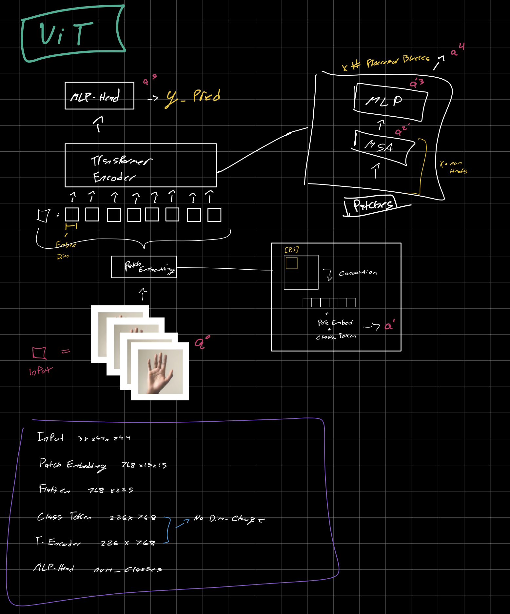

# Gesture Model Builder

This project implements a neural network training framework for American Sign Language (ASL) hand gesture recognition. It includes multiple model architectures suitable for both image and landmark data.





### 3D vs 2D Visualization



### Supported Opts

- **Model architectures**: Support for Convolutional Neural Network (CNN), Feed Forward Neural Network (ANN), and Vision Transformer (ViT) models.
- **Input data types**: Dataloaders for both image and landmark data types.
- **Hyperparameters**: Configurable via a YAML file, sgd, adam, mse, and cse supported.



## Design Notes





## Project Structure

- **model/**: Contains model definitions for CNN, ANN, and ViT.
  - cnn.py: Defines `ImageCNN`and`LandmarkCNN` models.
  - ann.py: Defines `ImageANN` and `LandmarkANN` models.
  - vit.py: Defines `ImageViT` model.
- **util/**: Utility functions for data loading and training.
  - data_loader.py: Class to create dataloaders for images and landmarks.
  - data_set.py: Class to create datasets and manage normalization for images and landmarks.
  - engine.py: Class for managing training and evaluating models.
  - process_landmarks.py: Class to extract landmark data from static images.
  - process_images.py: Class to crop hand offset from static images.
- **config/**: Contains yaml configuration files.
- train.py: Main script to start the training process.

### Configuration

The `config.yaml` file allows you to set various parameters for training. Below is an example configuration:

```yaml
data:
  data_type: "image"
  data_path: "./data/"
  batch_size: 8
  train_split: 0.75
  image_size: 224
  normalize: True
  center_wrist: True
  num_classes: 3

hyper:
  model: "cnn"
  epochs: 100
  learning_rate: 0.001
  optimizer: "sgd"
  criterion: "CrossEntropyLoss"

device: "cuda"

save_path: "./output/model.pth"
```
